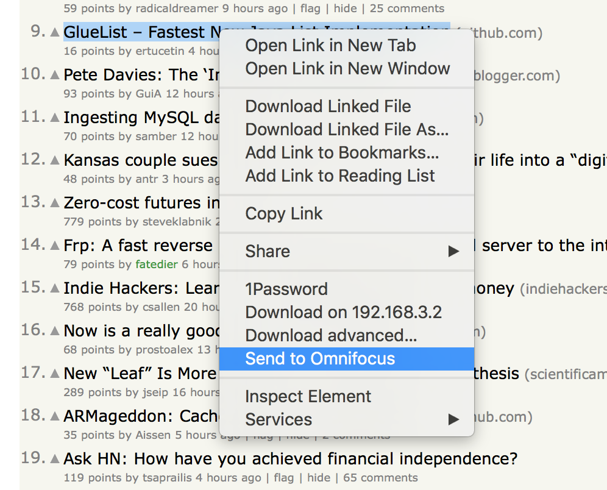

# Omnifari
Safari extension to send _things_ to Omnifocus. 

![screenshot1][1]

## Usage
- Click the button and it sends the current page to Omnifocus
- Rightclick a link to send a arbitrary link to Omnifocus

## License

MIT

[1]:	screenshots/ss1.png
[2]:	screenshots/ss2.png
